# Administración de openstack con Terraform

OpenStack es un proyecto de computación en la nube para proporcionar una infraestructura como servicio. Este proveedor se utiliza para interactuar con los muchos recursos soportados por OpenStack. 

### Conexión a Openstack

Creamos un directorio donde generaremos un entorno virtual.

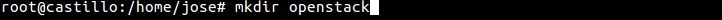

Instalamos el paquete virtualenv del repositorio.

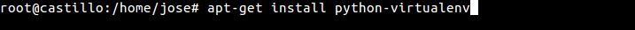

Nos situamos en la carpeta openstack y ejecutamos la siguiente sentencia.

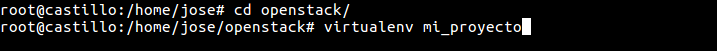

Ahora nos movemos al directorio mi_proyecto y activamos el entorno virtual

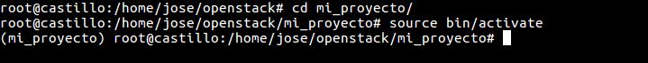

Instalamos el cliente openstack en el entorno virtual.

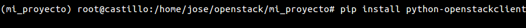

Exportamos la variable de entorno de terraform.

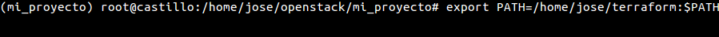

Ahora ya es posible establecer una conexión a openstack mediante un fichero terraform como el siguiente:

```bash
provider "openstack" {
  user_name   = "admin"
  tenant_name = "admin"
  domain_name = "Default"
  password    = "admin"
  auth_url    = "http://192.168.1.137/identity/v3"
}
```
Comenzamos el fichero especificando las credenciales de conexión de nuestro usuario en openstack.

- user_name: Nombre de usuario.
- tenant_name: Nombre de proyecto.
- domain_name: Nombre de dominio.
- password: Contraseña de usuario.
- auth_url: Dirección de autenticación.

Otros parámetros que se pueden especificar en la conexión:

- user_id: Id del usuario.
- tenant_id: Id del proyecto. 
- token: En el caso de no especificar ningún usuario se genera un medio de acceso temporal. 
- domain_id: Id del dominio. 
- insecure: Acepta la conexión a servidores con certificados menos seguros.
- cacert_file: Certificado CA del servidor.
- cert : Certificado del cliente.
- key : Clave privada del cliente.

### Subiendo par de claves

Creamos un fichero.tf el cual llamaremos keypair.tf, en el especificamos la conexión con el servidor openstack, en el resource le indicamos el id del plan de ejecución, en nuestro caso “keypair”, un nombre y la clave publica. 
```bash
provider "openstack" {
  user_name   = "admin"
  tenant_name = "admin"
  domain_name = "Default"
  password    = "admin"
  auth_url    = "http://192.168.1.137/identity/v3"
}

resource "openstack_compute_keypair_v2" "keypair" {
  name       = "josemaria"
  public_key = "ssh-rsa AAAAB3NzaC1yc2EAAAADAQABAAABAQDC4uo4aXvL+8f+y8pidtU5XGrJx46WKaIt5OW09VjcwnVuRx2tRWuAYGyvVrNHp8o91rklUUaKDcnSD+op4kEZOWd386pfK+osVNdVGQROO6U3i/uXFnI+FLY4GFhWA4VFY0OT00vLxRR4SPMOFVFYNfSLIr6IsQyD8ghc++j3h/qIZIKUGf8sR3LniyChDO6QQYkZw2iTJiTyAkFHH5/8ol9598lJ8rMSV7Fyh34t0b08avwD4alCz4ij9JVvcsT0aRbeEtDE0HCBY88r5bEJlcKPaRL3Z5UizYU26n+ZfQRm4A3A9IdpI0BZwXLlQV5kwvQp7AXkUnQ2qR2+91u7 jose@castillo"
}
```

Ahora ejecutamos el plan para subir la clave a openstack.
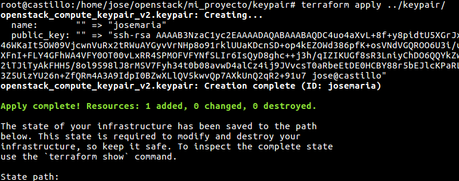


Accedemos a openstack para comprobar que nuestra clave publica se encuentra disponible.

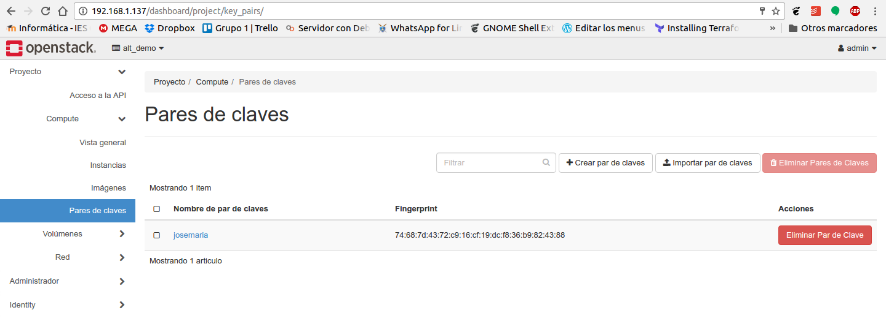

### Creando un volumen

Creamos un fichero.tf el cual llamaremos volumen.tf, en el especificamos la conexión con el servidor openstack, en el resource le indicamos el id del plan de ejecución, en nuestro caso “vol”, un nombre, descripción, tamaño en gigabytes, tipo de volumen y zona .
```bash
provider "openstack" {
  user_name   = "admin"
  tenant_name = "admin"
  domain_name = "Default"
  password    = "admin"
  auth_url    = "http://192.168.1.137/identity/v3"
}


resource "openstack_blockstorage_volume_v2" "vol" {
  name        = "vol_1"
  description = "volumen 1Gb"
  size        = 1
  volume_type = "lvmdriver-1"
  availability_zone = "nova"
}
```

Otros parámetros que se pueden especificar en la creación del volumen:

- region: Región en la que se crea el volumen.
- consistency_group_id: Id del grupo consistencia.
- image_id:Id de la imagen desde la cual creamos el volumen.
- metadatos: Metadatos clave / valor pares para asociar con el volumen.
- snapshot_id: Id de instantánea desde la cual creamos el volumen.
- source_replica: Id de volumen con el que se replicará.
- source_vol_id: Id de volumen desde el cual creamos el volumen.

Ejecutamos el plan para crear el volumen en openstack.

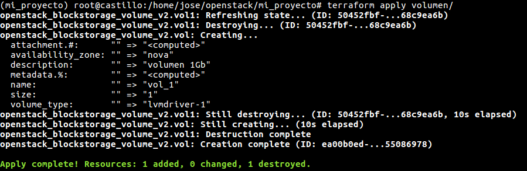

Accedemos a openstack y comprobamos que el volumen se ha creado correctamente.

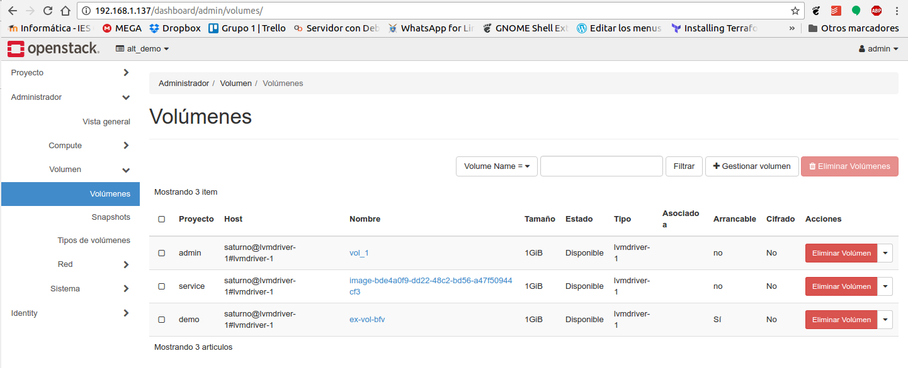

### Subiendo imágenes

Creamos un fichero.tf el cual llamaremos imagen.tf, en el especificamos la conexión con el servidor openstack, en el resource le indicamos el id del plan de ejecución, en nuestro caso imagen, un nombre, la ruta donde esta la imagen, formato de contenedor, y tipo de imagen.

```bash
provider "openstack" {
  user_name   = "admin"
  tenant_name = "admin"
  domain_name = "Default"
  password    = "admin"
  auth_url    = "http://192.168.1.137/identity/v3"
}

resource "openstack_images_image_v2" "imagen" {
  name   = "Debian 8"
  local_file_path = "/home/jose/Descargas/debian-8-openstack-amd64.qcow2"
  container_format = "bare"
  disk_format = "qcow2"
}
```

Otros parámetros que se pueden especificar en la subida de la imagen:

- container_format: Formato del contenedor ("ami", "ari", "aki", "bare", "ovf").
- disk_format: Formato de la imagen ("ami", "ari", "aki", "vhd", "vmdk", "raw", "qcow2", "vdi", "iso").
- image_cache_path: Es el directorio donde se descargarán las imágenes. El valor predeterminado es "$ HOME / .terraform / image_cache"
- image_source_url: Url de descarga de la imagen.
- min_disk_gb: Espacio de disco en GB necesario para iniciar la imagen. El valor predeterminado es 0.
- min_ram_mb: Memoria Ram en MB necesario para iniciar la imagen. El valor predeterminado es 0.
- protected: Especifica con valor true/false si la imagen puede ser eliminada.
- tags: Etiqueta de la imagen.
- Visibility: Visibilidad de la imagen.visibility ("public", "private","community", "shared").


Ejecutamos el plan para subir nuestra imagen a openstack.

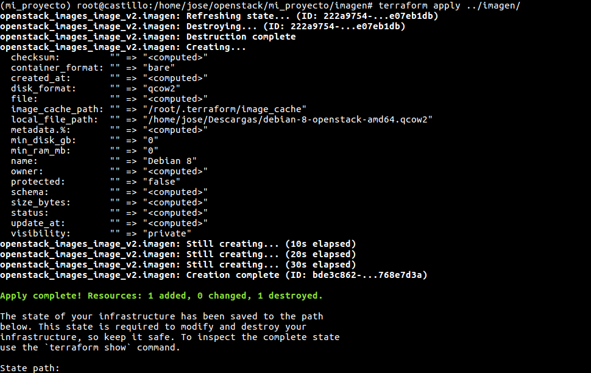

Comprobamos en openstack que se encuentra disponible la imagen subida.

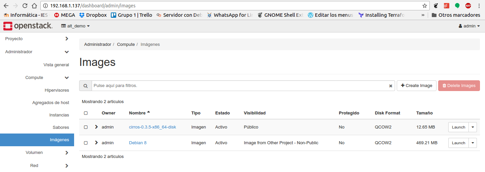

### Asignando ip flotantes al proyecto

Creamos un fichero.tf el cual llamaremos imagen.tf, en el especificamos la conexión con el servidor openstack, en el resource le indicamos el id del plan de ejecución, en nuestro caso ip, especificamos el pool. 

``` bash
provider "openstack" {
  user_name   = "admin"
  tenant_name = "admin"
  domain_name = "Default"
  password    = "admin"
  auth_url    = "http://192.168.1.137/identity/v3"
}

resource "openstack_compute_floatingip_v2" "ip" {
  pool = "public"
}
```

Otros parámetros que se pueden especificar asignando ip flotantes: 

- region: Región en la que se crea el volumen.
- pool: El nombre desde el cual obtener la IP flotante.


Ejecutamos el plan para reservar una ip flotante al proyecto.


Accedemos a openstack para comprobar que se ha reservado una ip flotante en el proyecto admin.

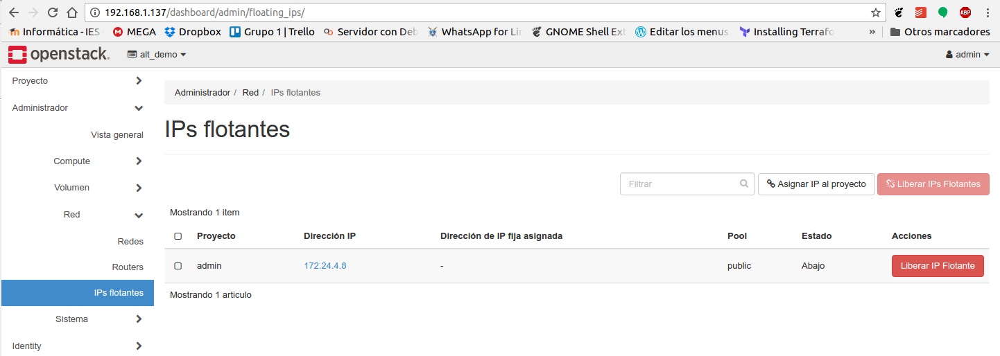

### Creando un nuevo grupo de seguridad

Creamos un fichero.tf el cual llamaremos seguridad.tf, en el especificamos la conexión con el servidor openstack, en el resource le indicamos el id del plan de ejecución, en nuestro caso gruposeguridad, especificamos el nombre del grupo de seguridad y la descripción.

```bash
provider "openstack" {
  user_name   = "admin"
  tenant_name = "admin"
  domain_name = "Default"
  password    = "admin"
  auth_url    = "http://192.168.1.137/identity/v3"
}

resource "openstack_networking_secgroup_v2" "gruposeguridad" {
  name        = "terraform"
  description = "Nuevo grupo de Seguridad creado desde Terraform"
  tenant_id   = "039182bb2d1c4c4cb806e380c9e2413c"
}
```

Ejecutamos el plan para crear el nuevo grupo de seguridad llamado terraform.

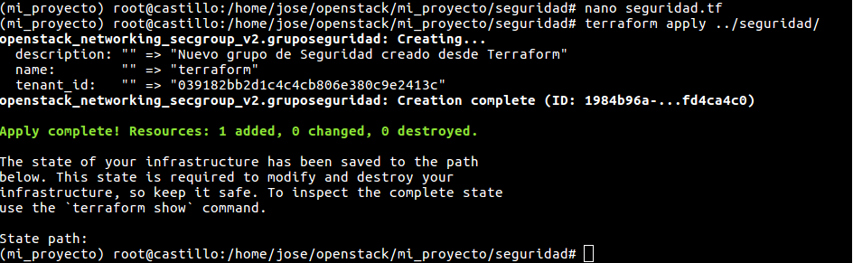

Ahora accedemos a openstack y comprobamos que se ha generado e nuevo grupo de seguridad.

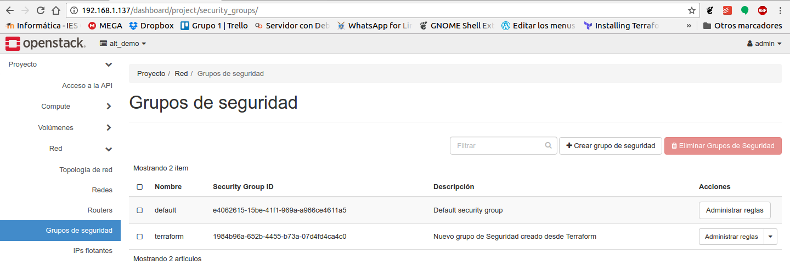

### Agregando regla de seguridad

Creamos un fichero.tf el cual llamaremos regla.tf, en el especificamos la conexión con el servidor openstack, en el resource le indicamos el id del plan de ejecución, en nuestro caso reglassh, especificamos el id del grupo de seguridad, la dirección de la regla si es de entrada o salida, tipo de red IPv4 o IPv6, protocolo de red y rango de puertos.

```bash
provider "openstack" {
  user_name   = "admin"
  tenant_name = "admin"
  domain_name = "Default"
  password    = "admin"
  auth_url    = "http://192.168.1.137/identity/v3"
}

resource "openstack_networking_secgroup_rule_v2" "reglassh" {
  direction         = "ingress"
  ethertype         = "IPv4"
  protocol          = "tcp"
  port_range_min    = 22
  port_range_max    = 22
  remote_ip_prefix  = "0.0.0.0/0"
  security_group_id = "aeebe670-38b5-4fff-a9c4-95f18510a9f3"
}

```

Ejecutamos el plan para añadir la nueva regla al grupo de seguridad terraform.

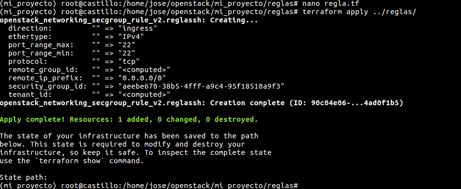

Comprobamos que se ha añadido la regla ssh en el grupo de seguridad de terraform en openstack.

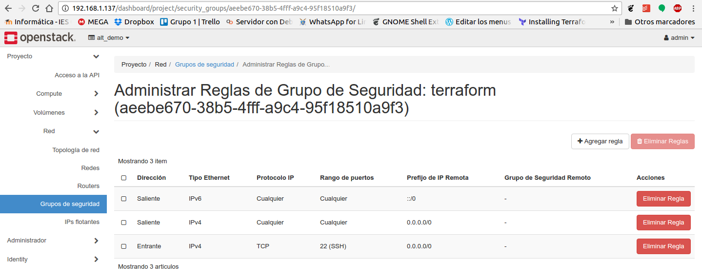

### Creando una red

Creamos un fichero.tf el cual llamaremos red.tf, en el especificamos la conexión con el servidor openstack, en el resource le indicamos el id del plan de ejecución, en nuestro caso red, especificamos un nombre, el Id del proyecto y el estado administración con valor true o false. 

```bash
provider "openstack" {
  user_name   = "admin"
  tenant_name = "admin"
  domain_name = "Default"
  password    = "admin"
  auth_url    = "http://192.168.1.137/identity/v3"
}
resource "openstack_networking_network_v2" "red" {
  name           = "teraform"
  admin_state_up = "true"
  tenant_id      = "039182bb2d1c4c4cb806e380c9e2413c"
}

```
Ejecutamos el plan para crear la red terraform.

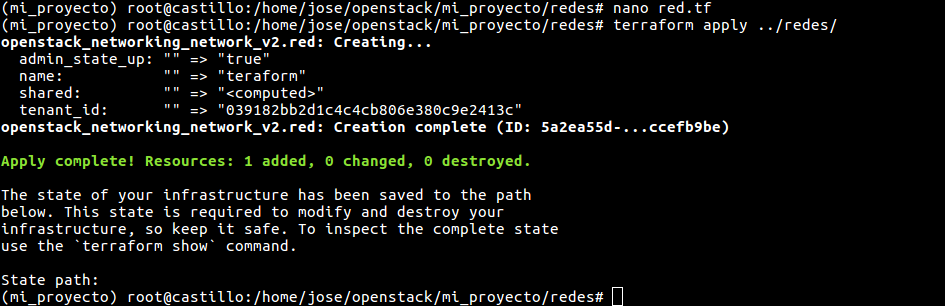

Ahora desde openstack accedemos a la topología de red para comprobar que se creado la nueva red.

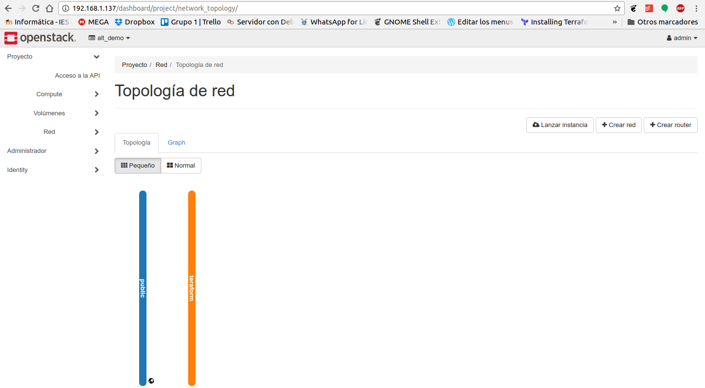

### Creando subred

Creamos un fichero.tf el cual llamaremos red.tf, en el especificamos la conexión con el servidor openstack, en el resource le indicamos el id del plan de ejecución, en nuestro caso subred, especificamos Id de la red, el rango de ip, el nombre y el Id del proyecto.

```bash
provider "openstack" {
  user_name   = "admin"
  tenant_name = "admin"
  domain_name = "Default"
  password    = "admin"
  auth_url    = "http://192.168.1.137/identity/v3"
}


resource "openstack_networking_subnet_v2" "subred" {
  network_id = "5a2ea55d-2253-410e-a331-e0f5ccefb9be"
  cidr       = "10.0.0.0/24"
  name       = "terraform"
  tenant_id  = "039182bb2d1c4c4cb806e380c9e2413c"
}

```
Ejecutamos el plan para crear la subred en openstack.

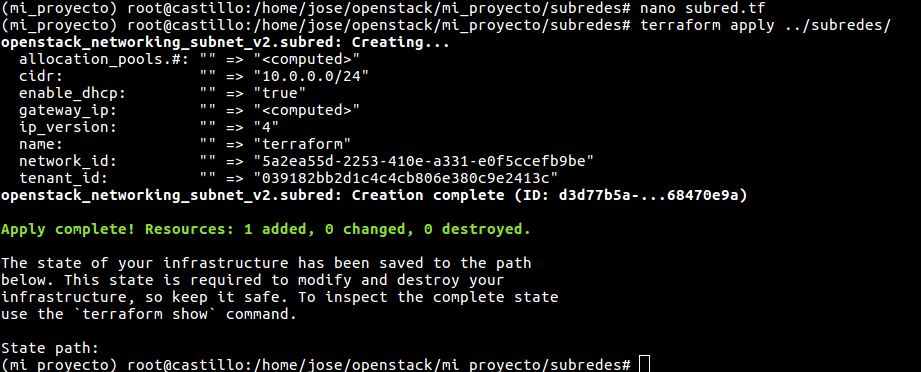

Comprobamos desde el apartado redes e openstack que se ha creado la subred.

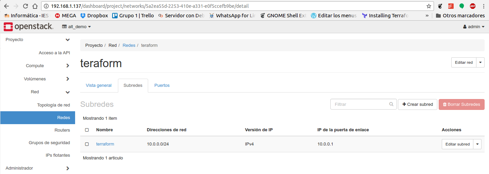

### Creando un router en la red pública

Creamos un fichero.tf el cual llamaremos router.tf, en el especificamos la conexión con el servidor openstack, en el resource le indicamos el id del plan de ejecución, en nuestro caso router_tf, especificamos un nombre, el Id del proyecto y el Id de la red pública. 
```bash
provider "openstack" {
  user_name   = "admin"
  tenant_name = "admin"
  domain_name = "Default"
  password    = "admin"
  auth_url    = "http://192.168.1.137/identity/v3"
}

resource "openstack_networking_router_v2" "router_tf" {
  name             = "router_tf"
  external_gateway = "c000a18b-689a-48ad-be82-c3671f3bb00c"
  tenant_id        = "039182bb2d1c4c4cb806e380c9e2413c"
}

```

Ejecutamos el plan para crear el router conectado a la red publica de openstack.

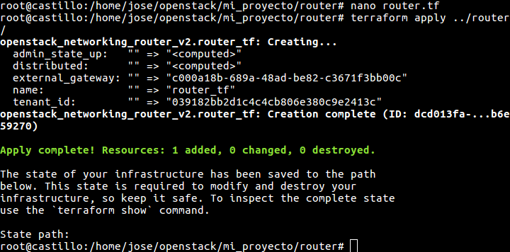

Comprobamos en openstack en el apartado topología de red que el router se ha generado.


### Creando interfaz de red en un router
Creamos un fichero.tf el cual llamaremos interfaz.tf, en el especificamos la conexión con el servidor openstack, en el resource le indicamos el id del plan de ejecución, en nuestro caso interfaz, especificamos el Id del router y el Id de la subred a la cual vamos a conectar.

~~~ bash
provider "openstack" {
  user_name   = "admin"
  tenant_name = "admin"
  domain_name = "Default"
  password    = "admin"
  auth_url    = "http://192.168.1.137/identity/v3"
}

resource "openstack_networking_router_interface_v2" "interfaz" {
  router_id = "dcd013fa-ed7c-4011-9aca-48afb6e59270"
  subnet_id = "d3d77b5a-380d-4eab-a50e-423868470e9a"
}
~~~

Ejecutamos el plan para crear la interfaz en el router creado en el punto anterior en openstack.

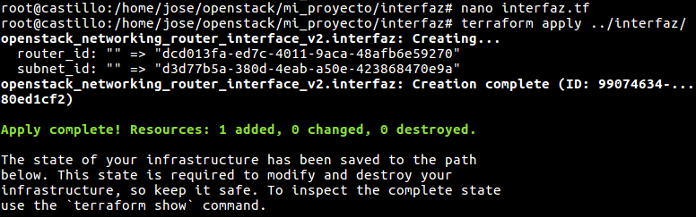

Comprobamos en openstack en el apartado topología de red que el router ahora tiene una segunda interfaz conectada a la red terraform.

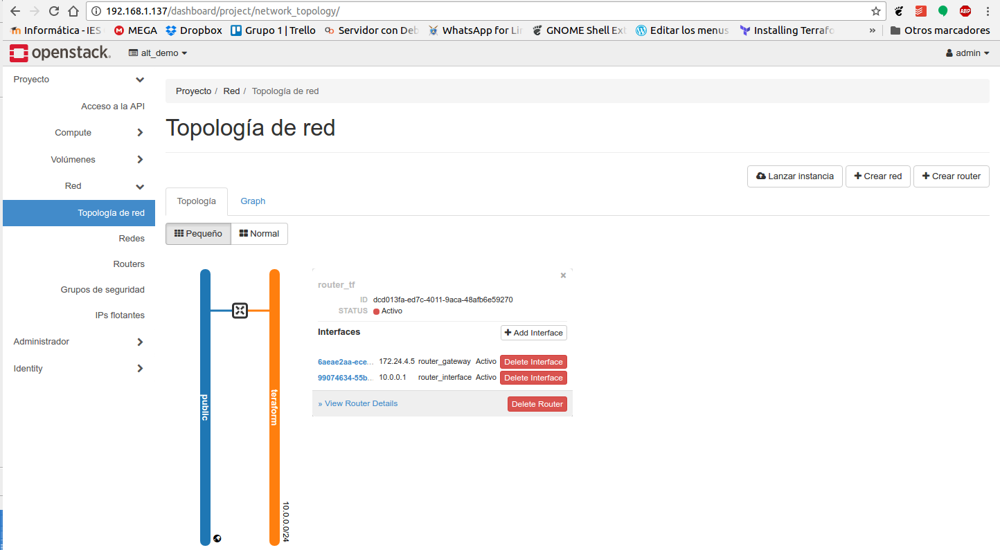


### Creando instancia
Creamos un fichero.tf el cual llamaremos instancia.tf, en el especificamos la conexión con el servidor openstack, en el resource le indicamos el id del plan de ejecución, en nuestro caso terraform, especificamos el nombre, Id de la imagen, Id del sabor, nombre par de claves, grupo de seguridad, red a la que va a pertenecer y ip flotante.

~~~ bash
provider "openstack" {
  user_name   = "admin"
  tenant_name = "alt_demo"
  domain_name = "Default"
  password    = "admin"
  auth_url    = "http://192.168.1.137/identity/v3"
}


resource "openstack_compute_instance_v2" "terraform" {
  name            = "terraform"
  image_id        = "bde4a0f9-dd22-48c2-bd56-a47f50944cf3"
  flavor_id       = "c1"
  key_pair        = "josemaria"
  security_groups = ["terraform"]

  metadata {
    this = "terraform"
  }

  network {
    name = "teraform"
    floating_ip = "172.24.4.4"
  }
}
~~~

Otros parámetros que se pueden especificar creando instancias:
- region: Región en la que se va a crear la instancia del servidor.
- image_name: El nombre de la imagen deseada para el servidor.
- flavor_name: El nombre del sabor deseado para el servidor.
- user_data: Datos de usuario que se deben proporcionar al iniciar la instancia.
- availability_zone: Zona de disponibilidad en la que se crea el servidor.
- network: Una matriz de una o más redes para adjuntar a la instancia.
- config_drive: Si desea utilizar la función config_drive para configurar la instancia.
- admin_pass: La contraseña administrativa para asignar al servidor. Al cambiar esto, se cambia la contraseña de root en el servidor existente.
- block_device: Configuración de los dispositivos de bloque.
- volume: Asosia un volumen existente a la instancia.
- scheduler_hints: Proporciona al planificador de Nova con sugerencias el cómo se debe iniciar la instancia.
- personality: Personaliza la personality de una instancia definiendo uno o más archivos y su contenido.
- stop_before_destroy: Intenta detener la instancia antes de destruirla, dando así la oportunidad de que los demonios SO invitados se detengan correctamente.

Ejecutamos el plan de para crear la instancia en openstack.

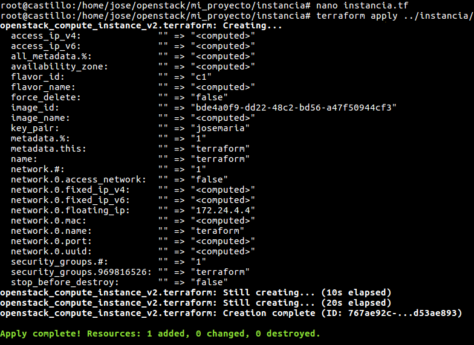

Comprobamos en openstack en el apartado Instancias que la maquina se ha creado.

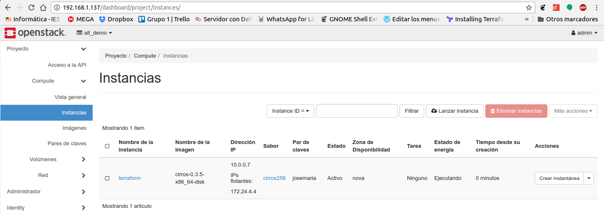

Accedemos a la maquina para comprobar que se ha creado.

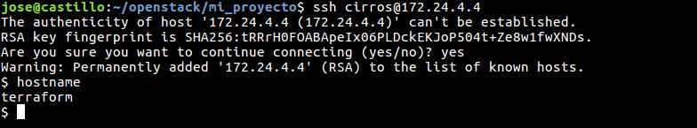


### Asociando un volumen a la máquina
Creamos un fichero.tf el cual llamaremos attach.tf, en el especificamos la conexión con el servidor openstack, en el resource le indicamos el id del plan de ejecución, en nuestro caso attached, especificamos el Id de la instancia y el Id del volumen.

~~~ bash
provider "openstack" {
  user_name   = "admin"
  tenant_name = "alt_demo"
  domain_name = "Default"
  password    = "admin"
  auth_url    = "http://192.168.1.137/identity/v3"
}


resource "openstack_compute_volume_attach_v2" "attached" {
  instance_id = "767ae92c-0602-4c89-bc24-76b4d53ae893"
  volume_id  = "49c97096-c3fe-412d-b598-24fbda878dd7"
}
~~~

Ejecutamos el plan de para asociar el volumen a la instancia creada en el apartado anterior.

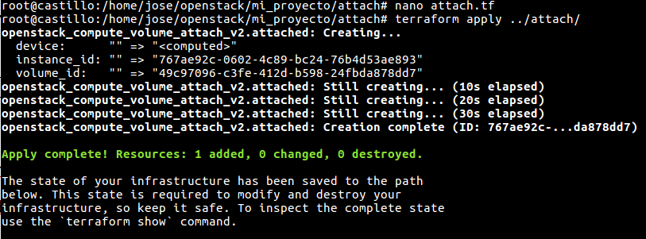

Comprobamos en openstack en el apartado Volúmenes que se ha a asociado a la maquina terraform.

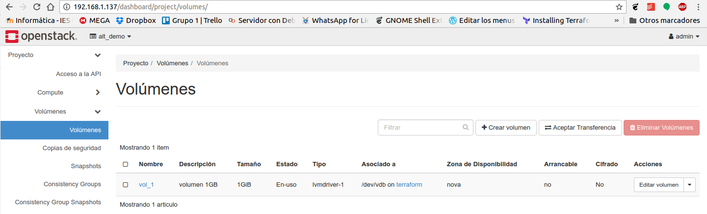

Accedemos a la máquina y comprobamos si tenemos el volumen nuevo.

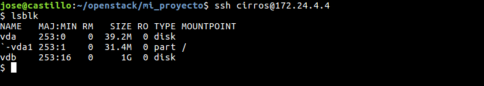


