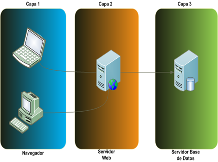
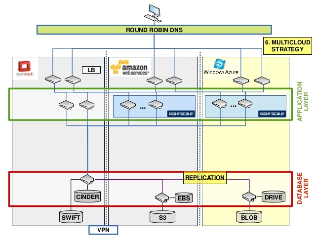

# Casos de uso

Terraform se puede usar para codificar la configuración requerida para una aplicación, asegurando que todos los complementos necesarios estén disponibles, pero puede ir aún más lejos: configurar un DNSimple para configurar un CNAME o configurar Cloudflare como CDN para la aplicación. Lo mejor de todo es que puede hacer todo esto en menos de 30 segundos sin usar una interfaz web.

### Aplicaciones de varios niveles

Un patrón muy común es la arquitectura N-tier. La arquitectura de dos niveles más común es un grupo de servidores web que utilizan un nivel de base de datos. Se añaden niveles adicionales para servidores API, servidores de almacenamiento en caché, mallas de enrutamiento, etc. Este patrón se utiliza porque los niveles se pueden escalar de forma independiente y proporcionar una separación de los servicios.

##### Arquitectura N-tier:

Terraform es una herramienta ideal para construir y gestionar estas infraestructuras. Cada nivel se puede describir como una colección de recursos y las dependencias entre cada nivel se manejan automáticamente; Terraform garantizará que el nivel de base de datos esté disponible antes de que se inicien los servidores web y que los equilibradores de carga tengan conocimiento de los nodos web. Cada nivel se puede escalar fácilmente usando Terraform modificando un único valor de configuración de count. Debido a que la creación y el aprovisionamiento de un recurso está codificado y automatizado, la escala elástica con carga se vuelve trivial.

### Clústers de autoservicio

Con un cierto tamaño de organización, se vuelve muy difícil para un equipo de operaciones centralizado gestionar una infraestructura grande y creciente. En cambio, se vuelve más atractivo crear una infraestructura de "autoservicio", lo que permite a los equipos de productos gestionar su propia infraestructura utilizando herramientas proporcionadas por el equipo de operaciones centrales.

Utilizando Terraform, el conocimiento de cómo construir y escalar un servicio puede ser codificado en una configuración. Las configuraciones de Terraform pueden ser compartidas dentro de una organización, permitiendo a los equipos de los clientes utilizar la configuración como una caja negra y utilizar Terraform como una herramienta para administrar sus servicios.

### Demos de Software

El software moderno está cada vez más conectado y distribuido. Aunque existen herramientas como Vagrant para crear entornos virtualizados para demostraciones, todavía es muy difícil de encontrar software en infraestructura real que se adapte más a los entornos de producción.

Los programadores de software pueden proporcionar una configuración de Terraform para crear, suministrar e iniciar una demostración de proveedores en la nube como AWS. Esto permite a los usuarios finales probar fácilmente el software en su propia infraestructura e incluso permite ajustar parámetros como el tamaño de clúster para probar más rigurosamente las herramientas a cualquier escala.

### Entornos de Prueba

Es una práctica común tener un entorno de producción o QA(quality assurance). Estos entornos son clones más pequeños del entorno de producción, pero se utilizan para probar nuevas aplicaciones antes de liberar en el entorno de producción. A medida que el entorno de producción crece y se vuelve más complejo, resulta cada vez más difícil de mantener actualizado.
Con Terraform, el entorno de producción puede ser codificado y luego compartido con  QA o dev. Estas configuraciones pueden utilizarse para hacer girar rápidamente nuevos entornos para probar y luego ser eliminados fácilmente. Esta herramienta puede ayudar a manejar la dificultad de mantener ambientes paralelos, y los hace práctico para crearlos y destruirlos elásticamente.

### Redes definidas por software

Las redes definidas por software (SDN) se está convirtiendo cada vez más frecuente en el centro de datos, ya que proporciona más control a los operadores y desarrolladores y permite a la red apoyar mejor las aplicaciones que se ejecutan en la capa superior. La mayoría de las implementaciones SDN tienen una capa de control y una capa de infraestructura.

Terraform se puede utilizar para codificar la configuración de redes definidas por software. Esta configuración puede entonces ser utilizada por Terraform para configurar y modificar automáticamente la configuración al interactuar con la capa de control. Esto permite que la configuración se versione y que los cambios sean automatizados. Como ejemplo, AWS Virtual Private Cloud(VPC) es una de las implementaciones SDN más utilizadas y puede ser configurada por Terraform.

### Programadores de recursos

En infraestructuras de gran escala, la asignación estática de aplicaciones a las máquinas se vuelve cada vez más difícil. Para resolver ese problema, hay una serie de orquestadores como Borg, Mesos, YARN y Kubernetes. Éstos se pueden utilizar para programar dinámicamente contenedores Docker, Hadoop, Spark y muchas otras herramientas de software.

Terraform no se limita a proveedores físicos como AWS (Amazon Web Services). Los planificadores de recursos pueden ser tratados como un proveedor, lo que permite a esta herramienta solicitar recursos de ellos. Esto permite que se utilice en capas: para configurar la infraestructura física que ejecuta los planificadores así como el aprovisionamiento en la red programada.

### Implementación de multi-cloud

A menudo es necesario extender la infraestructura a través de múltiples nubes para aumentar la tolerancia a fallos. Mediante el uso de una única región o proveedor de la nube, la tolerancia a fallos está limitada por la disponibilidad de ese proveedor. Tener un despliegue multi-cloud permite una recuperación más sencilla ante la pérdida de una región o de un proveedor entero.

##### Infraestructura multi-cloud:

Realizar implementaciones multi-nube puede ser muy difícil ya que muchas herramientas existentes para la administración de infraestructura son específicas de la nube. Terraform permite que una única configuración se utilice para administrar múltiples proveedores e incluso manejar dependencias entre nubes. Esto simplifica la gestión y la orquestación, ayudando a los operadores a construir infraestructuras multi-cloud a gran escala.