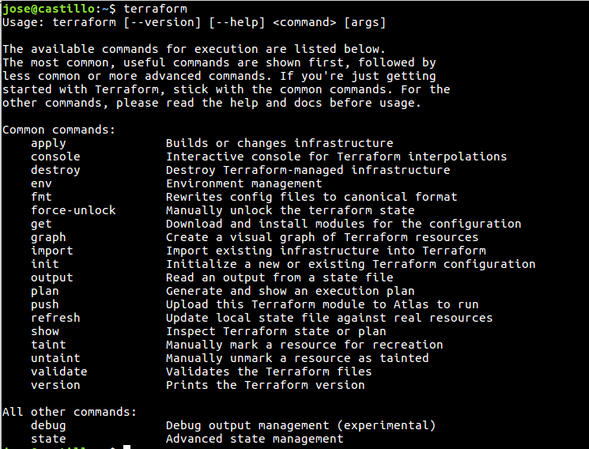
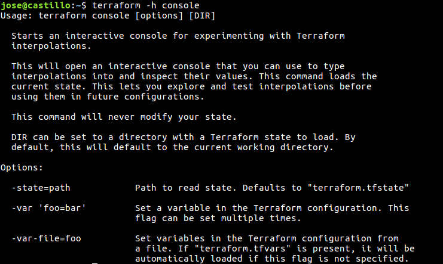

# Comandos de Terraform 

Terraform se controla a través de una interfaz de línea de comandos muy fácil de usar. Para ver una lista de los comandos disponibles en cualquier momento, simplemente ejecutamos terraform sin argumentos:

Para obtener ayuda para cualquier comando específico, introducimos el parámetro -h o --help al subcomando correspondiente. Por ejemplo, para ver la ayuda sobre el subcomando console.

### Comando apply

El comando terraform apply se utiliza para aplicar los cambios necesarios para alcanzar el estado deseado de la configuración, o el conjunto predefinido de acciones generado por un plan ejecución.

>  terraform apply [options] [dir-or-plan]

De forma predeterminada, apply examina el directorio actual de la configuración y aplica los cambios de forma adecuada. Sin embargo, se puede proporcionar una ruta a otra configuración o un plan de ejecución. Los planes de ejecución se pueden utilizar para ejecutar solamente un conjunto predeterminado de acciones.

Los indicadores de línea de comandos son todos opcionales. La lista de parámetros disponibles es:

- -backup=path - Ruta de acceso al archivo de copia de -backup=path . El valor predeterminado es -state-out con la extensión ".backup".

- -lock=true - Bloquea el archivo de estado cuando se admite el bloqueo.

- -lock-timeout=0s - Duración de volver a intentar un bloqueo de estado.

- -input=true - Solicita entrada para variables si no se establece directamente.

- -no-color - Desactiva la salida con color.

- -parallelism=n - Limita el número de operaciones concurrentes cuando Terraform recorre el gráfico .

- -refresh=true - Actualiza el estado de cada recurso antes de planificar y aplicar. Esto no tiene efecto si un archivo del plan se da directamente para aplicar.

- -state=path - Ruta al archivo de estado. El valor predeterminado es "terraform.tfstate". Se ignora cuando se utiliza el estado remoto .

- -state-out=path - Ruta para escribir el archivo de estado actualizado. Por defecto 

- -state usará la ruta. Se ignora cuando se utiliza el estado remoto .

- -target=resource - Una dirección de recursos para el destino. La operación se limitará a este recurso y a sus dependencias. Este indicador se puede utilizar varias veces.

- -var 'foo=bar' - Establece una variable en la configuración de Terraform. Este indicador se puede establecer varias veces. Los valores de las variables se interpretan como Lenguaje de Configuración HashiCorp (HCL) , por lo que los valores de lista y mapa se pueden especificar mediante este indicador.

- -var-file=foo - Establece variables en la configuración de Terraform desde un archivo de variable . Si "terraform.tfvars" está presente, se cargará automáticamente primero. Cualquier archivo especificado por -var-file reemplaza cualquier valor en un "terraform.tfvars". Este indicador se puede utilizar varias veces.

### Comando console

El comando terraform console crea una consola interactiva.

> terraform console [options] [dir]

Esto es útil para probar antes de usarlas en configuraciones, así como interactuar con un estado existente.

Si no existe un archivo de estado, la consola todavía funciona y se puede utilizar para experimentar con funciones compatibles. 

El dir se puede utilizar para abrir una consola para un directorio de configuración de Terraform específico. Esto cargará cualquier estado de ese directorio, así como la configuración. El valor predeterminado es el directorio de trabajo actual. El comando  console no requiere que el estado de Terraform o la configuración funcione.

La lista de parámetros disponible es:
- -state=path - Ruta al archivo de estado. De forma terraform.tfstate a terraform.tfstate . No es necesario que exista un archivo de estado.
Puede cerrar la consola con el comando exit o mediante Control-C o Control-D.

### Comando destroy

El comando terraform destroy se utiliza para destruir la infraestructura gestionada por Terraform.
> terraform destroy [options] [dir]

La infraestructura gestionada por Terraform será destruida. Esto pedirá confirmación antes de destruir. Este comando acepta todos los argumentos y parámetros que acepta el comando apply , con la excepción de un argumento de archivo de plan.

Si se establece -force , entonces la confirmación de destruir no se mostrará.

El indicador -target , en lugar de afectar a las "dependencias", también destruirá los recursos que dependan de los objetivos especificados.

El comportamiento de cualquier comando de destrucción de terraform se puede previsualizar en cualquier momento con un comando equivalente terraform plan -destroy.

### Comando  env

El comando terraform env se utiliza para administrar entornos. Este comando es un subcomando anidado, lo que significa que tiene subcomandos adicionales.
> terraform env [nombre]

- list: El comando mostrará todos los entornos creados.

- select: El comando terraform env select se utiliza para seleccionar un entorno diferente ya creado.

- new: El comando terraform env new se utiliza para crear un nuevo entorno de estado.

- delete: El comando terraform env delete se utiliza para eliminar un entorno existente.

### Comando fmt

El comando terraform fmt se utiliza para reescribir los archivos de configuración de Terraform a un formato y estilo normalizado.
> terraform fmt [options] [dir]

De forma predeterminada, fmt explora el directorio actual para los archivos de configuración. Si se proporciona el argumento dir , entonces escaneará ese directorio dado. Si dir es un solo guión ( - ) entonces fmt leerá desde entrada estándar (STDIN).

- -list=true - Lista de archivos cuyo formato difiere (desactivado si se utiliza STDIN).

- -write=true - Escribe el resultado en el archivo fuente en lugar de STDOUT (deshabilitado si utiliza STDIN).

- -diff=false - Mostrar diferencias de cambios de formato.

### Comando force-unlock

Este comando elimina el bloqueo del estado para la configuración actual. El comportamiento de este bloqueo depende del backend que se utiliza. Los archivos de estado local no pueden desbloquearse por otro proceso. Este comando no modificará la infraestructura.
> terraform force-unlock [dir]

Opciones:
- -force – Fuerza la eliminación del bloqueo del estado para la configuración actual.

### Comando get

El comando terraform get se utiliza para descargar y actualizar módulos.
> terraform get [options] [dir]

Los módulos se descargan en una carpeta .terraform local. Esta carpeta no debe asignarse al control de versiones. La carpeta .terraform se crea en relación con su directorio de trabajo actual, independientemente del argumento dir dado a este comando.

Opciones:
- -update - Con la opción update a los módulos descargados comprueba si tienen actualizaciones y se las descarga si esta disponible.

### Comando graph

El comando terraform graph se utiliza para generar una representación visual de una configuración o plan de ejecución.

> terraform graph [options] [dir]

Emite el gráfico de dependencia visual de los recursos de Terraform según los archivos de configuración en dir (o el directorio actual si se omite).

El gráfico se emite en formato DOT. El programa típico que puede leer este formato es GraphViz, pero muchos servicios web también están disponibles para leer este formato.

Opciones:
- -draw-cycles - Destaque cualquier ciclo en el gráfico con bordes coloreados. Esto ayuda al diagnosticar errores de ciclo.

- -no-color - Si se especifica, la salida no contendrá ningún color.

- -type=plan - Tipo de gráfico de salida. Puede ser: plan, plan-destroy, apply, legacy.

### Comando import

El comando de terraform import se utiliza para importar recursos a Terraform.
terraform import [options] ADDRESS ID

La importación buscará el recurso existente del ID y lo importará en la ADDRESS dada.

ADDRESS debe ser una dirección de recurso válida. Dado que cualquier dirección de recursos es válida, el comando import puede importar recursos en módulos.

ID depende del tipo de recurso importado. Por ejemplo, para instancias de AWS es el ID i-abcd1234 ( i-abcd1234 ), pero para las zonas de AWS Route53 es el ID de zona ( Z12ABC4UGMOZ2N ). Cada proveedor tiene su formato de ID.

Opciones:
- -backup=path - Ruta de acceso al archivo de estado -backup=path . La opción predeterminada es la ruta -state-out con la extensión ".backup". Establecer en "-" para deshabilitar las copias de seguridad.

- -config=path - Ruta al directorio de archivos de configuración de Terraform que configuran el proveedor para la importación. El valor predeterminado es su directorio de trabajo. Si este directorio no contiene archivos de configuración de Terraform, el proveedor debe configurarse a través de entradas manuales o variables.

- -input=true - Si desea solicitar información para la configuración del proveedor.

- -lock=true - Bloquea el archivo de estado cuando se admite el bloqueo.

- -lock-timeout=0s - Duración de volver a intentar un bloqueo de estado.

- -no-color - Si se especifica, la salida no contendrá ningún color.

- -provider=provider - Proveedor especificado para usar para la importación. Se utiliza para especificar alias de proveedor, como "aws.eu". Por defecto, el proveedor normal se basa en el prefijo del recurso que se está importando. Por lo general, no es necesario especificar esto.

- -state=path - La ruta de acceso para leer y guardar archivos de estado (a menos que se especifique estado-out). 

- -state-out=path - Ruta para escribir el archivo de estado final. De forma predeterminada, esta es la ruta de estado. 

- -var 'foo=bar' - Establece una variable en la configuración de Terraform. Este indicador se puede establecer varias veces. Los valores de las variables se interpretan como HCL , por lo que los valores de lista y mapa se pueden especificar mediante este indicador. 

- -var-file=foo - Establece variables en la configuración de Terraform desde un archivo de variable . Si "terraform.tfvars" está presente, se cargará automáticamente primero. Cualquier archivo especificado por -var-file valor en un "terraform.tfvars". 

### Comando init

El comando terraform init se utiliza para inicializar una configuración de Terraform. Este es el primer comando que se debe ejecutar para cualquier configuración de Terraform nueva o existente.
> terraform init [options] [SOURCE] [PATH]

Opciones:
- -backend=true - Inicializa el backend para este entorno.

- -backend-config=value - El valor puede ser una ruta a un archivo HCL o una cadena en el formato de 'key = value'. Esto especifica la configuración adicional para combinar para el backend. Esto se puede especificar varias veces. Los indicadores especificados más adelante en la línea anulan los especificados anteriormente si entran en conflicto.

- -get=true - Descargue cualquier módulo para esta configuración.

- -input=true - Solicite información interactiva si es necesario. Si esto es falso y la entrada es init , init error.

- -lock=true - Bloquea el archivo de estado cuando se admite el bloqueo.

- -lock-timeout=0s - Duración de volver a intentar un bloqueo de estado.

- -no-color - Si se especifica, la salida no contendrá ningún color.

- -force-copy - Suprime las indicaciones sobre la copia de datos de estado. Esto es equivalente a proporcionar un "sí" a todos los mensajes de confirmación.

### Comando output

El comando terraform output se utiliza para extraer el valor de una variable de salida de un fichero de estado.
> terraform output [options] [name]

Opciones:
- -json - Si se especifica, las salidas se formatean como un objeto JSON, con una clave por salida. Si se especifica [name] , sólo se devolverá la salida especificada. Esto se puede canalizar en herramientas tales como jq para el procesamiento adicional.

- -state=path - Ruta al archivo de estado. El valor predeterminado es "terraform.tfstate". Se ignora cuando se utiliza el estado remoto .

- -module=module_name - La ruta del módulo que ha -module=module_name salida. Por defecto es la ruta raíz. Otros módulos se pueden especificar mediante una lista separada por períodos. Ejemplo: "foo" haría referencia al módulo "foo" pero "foo.bar" haría referencia al módulo "bar" en el módulo "foo".

### Comando plan

El comando terraform plan se utiliza para crear un plan de ejecución. Terraform realiza una actualización, a menos que se deshabilite explícitamente y, a continuación, determina qué acciones son necesarias para lograr el estado deseado especificado en los archivos de configuración.

> terraform plan [options] [dir-or-plan]

Opciones:
- -destroy - Si se establece, genera un plan para destruir todos los recursos conocidos.

- -detailed-exitcode - Devuelve un código de salida -detailed-exitcode cuando sale el comando. Cuando se proporciona, este argumento cambia los códigos de salida y sus significados para proporcionar información más granular sobre lo que el plan resultante contiene:
> 0 = Sin cambios
> 1 = Error
> 2 = Cambios presentes

- -input=true - Solicitar entrada para variables si no se establece directamente.

- -lock=true - Bloquea el archivo de estado cuando se admite el bloqueo.

- -lock-timeout=0s - Duración de volver a intentar un bloqueo de estado.

- -module-depth=n - Especifica la profundidad de los módulos a mostrar en la salida. Esto no afecta al plan en sí, sólo la salida mostrada. De forma predeterminada, esto es -1, lo que ampliará todo.

- -no-color - Desactiva la salida con color.

- -out=path - La ruta para guardar el plan de ejecución generado. Este plan se puede utilizar con terraform apply para terraform apply de que solo se aplican los cambios que se muestran en este plan. Lea la advertencia sobre los planes guardados a continuación.

- -parallelism=n - Limita el número de operaciones concurrentes cuando Terraform recorre el gráfico .

- -refresh=true - Actualiza el estado antes de verificar las diferencias.

- -state=path - Ruta al archivo de estado. El valor predeterminado es "terraform.tfstate". Se ignora cuando se utiliza el estado remoto .

- -target=resource - Una -target=resource al destino. La operación se limitará a este recurso ya sus dependencias. Este indicador se puede utilizar varias veces.

- -var 'foo=bar' - Establece una variable en la configuración de Terraform. Este indicador se puede establecer varias veces. Los valores de las variables se interpretan como HCL , por lo que los valores de lista y mapa se pueden especificar mediante este indicador.

- -var-file=foo - Establece variables en la configuración de Terraform desde un archivo de variable . Si "terraform.tfvars" está presente, se cargará automáticamente primero. Cualquier archivo especificado por -var-file valor en un "terraform.tfvars". Este indicador se puede utilizar varias veces.

### Comando push

El comando terraform push carga su configuración de Terraform para que sea gestionada por Terraform Enterprise. Al cargar su configuración en Terraform Enterprise, puede ejecutar Terraform automáticamente, guardará todas las transiciones de estado, planes y mantendrá un historial de todas las ejecuciones de Terraform.

Esto hace que sea mucho más fácil usar Terraform como un equipo: los miembros del equipo modifican las configuraciones de Terraform localmente y continúan usando el control de versión normal. Cuando las configuraciones de Terraform están listas para ser ejecutadas, son enviadas a Terraform Enterprise, y cualquier miembro de su equipo puede ejecutar Terraform con solo pulsar un botón.

> terraform push [options] [path]

Opciones:
- -atlas-address=<url> - Una dirección alternativa a una instancia. 

- -upload-modules=true - Si es true ( -upload-modules=true ), entonces los módulos que se usan están bloqueados en su comprobación actual y cargados completamente. 

- -name=<name> - Nombre de la configuración de la infraestructura en Terraform Enterprise. El formato de este es: "nombre de usuario / nombre" para que pueda cargar configuraciones no sólo a su cuenta, sino a otras cuentas y organizaciones. 

- -no-color - Desactiva la salida con color

- -overwrite=foo - Marca una variable -overwrite=foo . Normalmente, si ya está definida una variable, Terraform no enviará el valor local (aunque sea diferente). Esto obliga a enviar el valor local a Terraform Enterprise.

- -token=<token> - El token de API de Terraform Enterprise que se utiliza para autorizar la subida. Si está en blanco o no especificado, se utilizará la variable de ATLAS_TOKEN ATLAS_TOKEN.

- -var='foo=bar' - -var='foo=bar' el valor de una variable para la configuración de Terraform.

- -var-file=foo - Establece el valor de las variables usando un archivo de variable. Este indicador se puede utilizar varias veces.

- -vcs=true - Si es true (por defecto), entonces Terraform detectará si un VCS está en uso, como Git, y solo subirá archivos que estén comprometidos con el control de versiones. Si no se detecta ningún sistema de control de versiones, Terraform cargará todos los archivos en path (parámetro al comando).

### Comando refresh

El comando terraform refresh se utiliza para actualizar el fichero de estado usando la infraestructura real. Esto se puede utilizar para detectar cualquier diferencia desde el último estado conocido.

> terraform refresh [options] [dir]

Opciones:
- -backup=path - Ruta de acceso al archivo de copia de -backup=path . El valor predeterminado es -state-out con la extensión ".backup". Deshabilitado ajustando a "-".

- -no-color - Desactiva la salida con color

- -input=true - Solicitar entrada para variables si no se establece directamente.

- -lock=true - Bloquea el archivo de estado cuando se admite el bloqueo.

- -lock-timeout=0s - Duración de volver a intentar un bloqueo de estado.

- -no-color - Si se especifica, la salida no contendrá ningún color.

- -state=path - Ruta de acceso para leer y escribir el archivo de estado en. El valor predeterminado es "terraform.tfstate". Se ignora cuando se utiliza el estado remoto .

- -state-out=path - Ruta para escribir el archivo de estado actualizado. De forma -state , se -state ruta -state . Se ignora cuando se utiliza el estado remoto .

- -target=resource - Una -target=resource al destino. La operación se limitará a este recurso ya sus dependencias. Este indicador se puede utilizar varias veces.

- -var 'foo=bar' - Establece una variable en la configuración de Terraform. Este indicador se puede establecer varias veces. Los valores de las variables se interpretan como HCL , por lo que los valores de lista y mapa se pueden especificar mediante este indicador.

- -var-file=foo - Establece variables en la configuración de Terraform desde un archivo de variable . Si "terraform.tfvars" está presente, se cargará automáticamente primero. Cualquier archivo especificado por -var-file valor en un "terraform.tfvars". Este indicador se puede utilizar varias veces.

### Comando show
El comando terraform show se utiliza para proporcionar una salida legible para humanos desde un archivo de estado o de plan.

> terraform show [options] [path]

Opciones:
- -module-depth=n - Especifica la profundidad de los módulos a mostrar en la salida. De forma predeterminada, esto es -1, lo que ampliará todo.

- -no-color - Desactiva la salida con color.

### Comando state

El comando terraform state se utiliza para la administración avanzada del estado. A medida que su uso se vuelve más avanzado, hay casos en los que puede ser necesario modificar el estado de Terraform. En lugar de modificar el estado directamente, los comandos terraform state se pueden utilizar en muchos casos en su lugar. 

Todos los terraform state que modifican el estado escriben archivos de copia de seguridad. La ruta de acceso de estos archivos de copia de seguridad se puede controlar con -backup .

Subcomandos que son de sólo lectura no escriben ningún archivo de copia de seguridad ya que no están modificando el estado.

Tenga en cuenta que las copias de seguridad para la modificación de estado no se pueden desactivar. Debido a la sensibilidad del archivo de estado, Terraform obliga a cada comando de modificación de estado a escribir un archivo de copia de seguridad. Tendrá que quitar estos archivos manualmente si no desea mantenerlos alrededor. 

> terraform state <subcommand> [options] [args]

Subcomandos:
- list: Enumera los recursos dentro de un estado de Terraform.

- mv: Mueve elementos en un estado de Terraform .

- pull: El comando terraform state pull se utiliza para descargar y enviar manualmente el estado desde el estado remoto.

- push: Carga manualmente un archivo de estado local en estado remoto. 

- rm: Elimina elementos del estado Terraform. 

- show: Muestra los atributos de un solo recurso en el estado Terraform.

### Comando taint

El comando terraform taint marca manualmente un recurso gestionado por Terraform como corrupto, forzándolo a ser destruido y recreado en la siguiente aplicación.

Este comando no modificará la infraestructura, sino que modificará el archivo de estado para marcar un recurso como corrupto. Una vez que un recurso está marcado como corrupto, el siguiente plan mostrará que el recurso será destruido y recreado y el siguiente implementará este cambio. 

> terraform taint [options] name

El argumento name es el nombre del recurso para marcar como corrupto. El formato de este TYPE.NAME es TYPE.NAME , como aws_instance.foo

Opciones:
- -allow-missing - Si se especifica, el comando tendrá éxito (código de salida 0) aunque falte el recurso. 

- -backup=path - Ruta de acceso al archivo de copia de -backup=path . El valor predeterminado es -state-out con la extensión ".backup". 

- -lock=true - Bloquea el archivo de estado cuando se admite el bloqueo.

- -lock-timeout=0s - Duración para volver a intentar un bloqueo de estado.

- -module=path - La ruta del módulo donde existe el recurso corrupto. Por defecto es la ruta raíz. 

- -no-color - Desactiva la salida con color

- -state=path - Ruta de acceso para leer y escribir el archivo de estado. El valor predeterminado es "terraform.tfstate". 

- -state-out=path - Ruta para escribir el archivo de estado actualizado. De forma -state , se -state ruta -state . 

### Comando validate

El comando terraform validate se utiliza para validar la sintaxis de los ficheros con extensión “.tf” de terraform. Realiza una comprobación de sintaxis en todos los archivos del directorio y mostrará un error si alguno de los archivos no se valida.

> terraform validate [dir]

### Comando untaint

El comando terraform untaint desmarca manualmente un recurso gestionado por Terraform como corrupto, restaurándolo como la instancia primaria en el estado.

> terraform untaint [options] name

Opciones:
- -allow-missing - Si se especifica, el comando tendrá éxito (código de salida 0) aunque falte el recurso.

- -backup=path - Ruta de acceso al archivo de copia de -backup=path . El valor predeterminado es -state-out con la extensión ".backup". 

- -index=n - Selecciona una única instancia corrupta cuando hay más de una instancia corrompida presente en el estado de un recurso dado. Este indicador es necesario cuando hay varias instancias infectadas.

- -lock=true - Bloquea el archivo de estado cuando se admite el bloqueo.

- -lock-timeout=0s - Duración para volver a intentar un bloqueo de estado.

- -module=path - La ruta del módulo donde existe el recurso corrupto. Por defecto es la ruta raíz. 

- -no-color - Desactiva la salida con color

- -state=path - Ruta de acceso para leer y escribir el archivo de estado. El valor predeterminado es "terraform.tfstate".

- -state-out=path - Ruta para escribir el archivo de estado actualizado. De forma -state , se -state ruta -state .