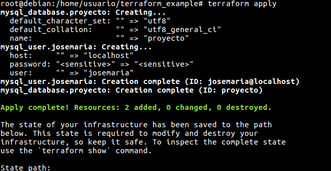
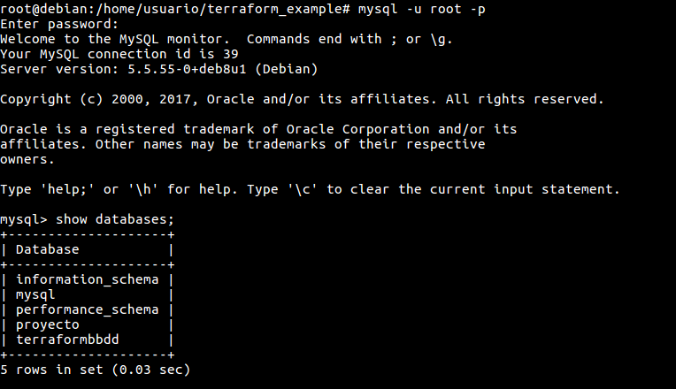
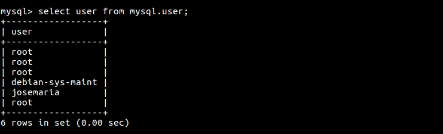
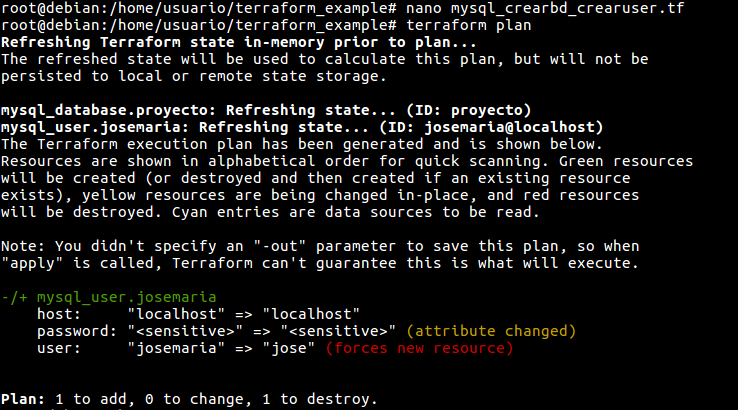
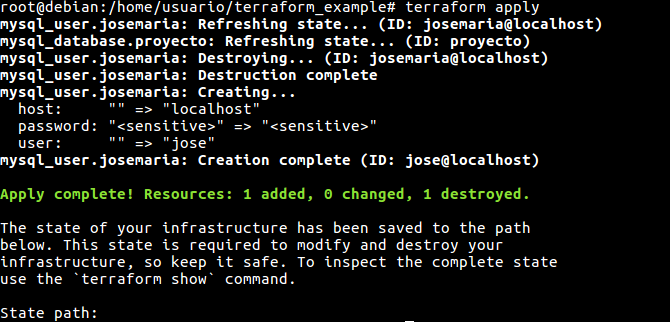
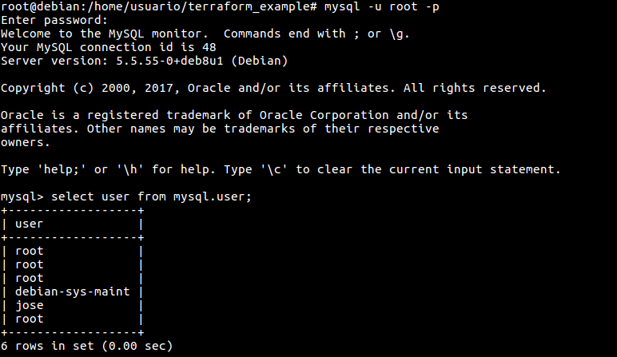
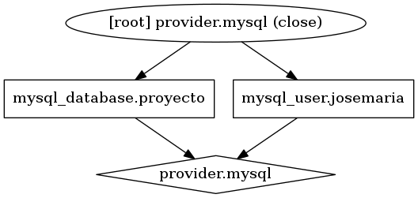
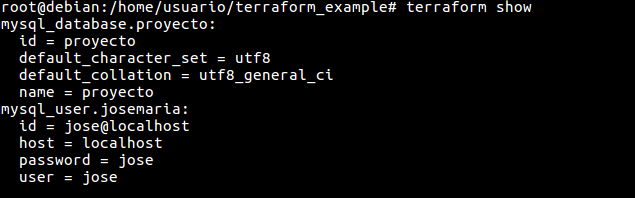

# Comenzando con Terraform
Creando nuestro primer fichero de configuración en el cual vamos a crear una base de datos y un usuario en mysql, en una maquina virtual con sistema operativo debian 8 jessie.

### Creando un fichero Terraform
Con el un editor de texto creamos el fichero de configuración.
~~~ bash
# nano mysql_crearbd_crearuser.tf

# Configuracion the MySQL server
provider "mysql" {
  endpoint = "localhost:3306"
  username = "root"
  password = "root"
}

# Crear base de datos
resource "mysql_database" "proyecto" {
  name = "proyecto"
}

# Crear usuario
resource "mysql_user" "josemaria" {
  user     = "josemaria"
  host     = "localhost"
  password = "josemaria"
}
~~~

### Creando un plan de ejecución
Ahora procedemos a ejecutar el comando terraform apply para crear nuestra base de datos y el usuario en en el servidor mysql.

Ahora entramos en la consola de mysql y comprobamos que se han creado la base de datos y el usuario.

### Actualizando el plan de ejecución
Modificando el plan de ejecución, en nuestro caso cambiaremos el estado del fichero creado anteriormente, en el que modificamos el usuario y la clave del usuario mysql.

En la imagen comprobamos que al ejecutar terraform plan detecta el cambio en el estado del fichero y nos informa que para llevar acabo el cambio tenemos que ejecutar terraform apply.

Volvemos abrir la consola de mysql y consultamos los usuarios de la base de datos de mysql. Como comprobamos se ha eliminado el usuario creado en el primer plan de ejecución y se ha generado el nuevo usuario definido en el fichero de configuración de terraform.

### Representando el plan de ejecución gráficamente
Representando nuestra infraestructura de terraform, representaremos la infraestructura creada anteriormente. En nuestro caso generamos una imagen con terraform graph y GraphViz.

Lo primero instalamos el paquete gráfico GraphViz:

~~~ bash
# apt install GraphViz
~~~

Una vez instalado el paquete ejecutamos el siguiente comando para generar una imagen en formato png.

~~~ bash
# terraform graph | dot -Tpng > mysql.png 
~~~

Nos dirigimos al directorio donde se ha generado la imagen y la abrimos con el visor de imágenes.

Para visualizar el plan de ejecución ejecutaremos el comando terraform show.

