# Instalación de Terraform

Para instalar Terraform, descargamos el paquete apropiado para nuestro sistema desde
la página oficial de Terraform.

Sistemas operativos compatibles con Terraform:
* Linux: 32­bit | 64­bit | Arm
* Windows:  32­bit | 64­bit
* Mac OS X:  64­bit
* FreeBSD:  32­bit | 64­bit | Arm
* OpenBSD:  32­bit | 64­bit
* Solaris:  64­bit

### Instalación en sistema operativo Linux
Vamos a la página oficial https://www.terraform.io/downloads.html. En ella
encontramos los binarios.

Seleccionamos el sistema operativo y la arquitectura, en nuestro caso elegiremos Linux 64­bit puesto que lo instalaremos en una maquina Debian jessie.

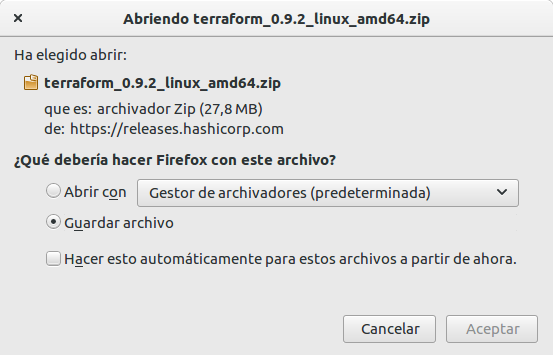

Creamos un directorio para los binarios de Terraform.

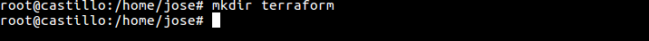

Moveremos el fichero descargado anteriormente al interior de la carpeta.

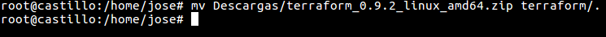

Nos situamos en el directorio terraform.

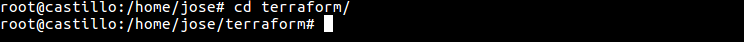

Descomprimimos los binarios de Terraform con el comando unzip.

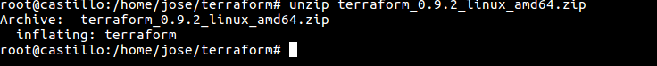

Exportamos las variables de entorno de Terraform.

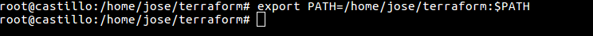

Por último comprobamos que se ha instalado bien ejecutando el comando siguiente:

### Instalación en sistema operativo Windows
Vamos a la página oficial https://www.terraform.io/downloads.html. En ella
encontramos el ejecutable.

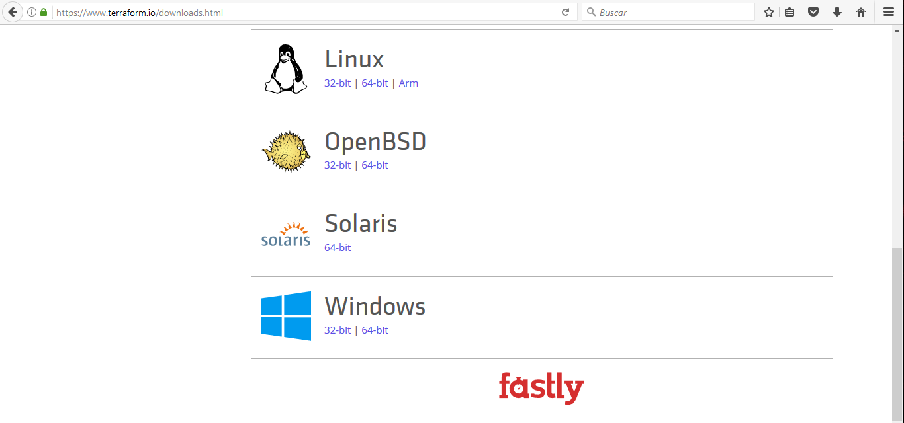

Seleccionamos   el   sistema   operativo   y   la   arquitectura,   en   nuestro   caso   elegiremos Windows 64­bit puesto que lo instalaremos en una maquina Windows 10.

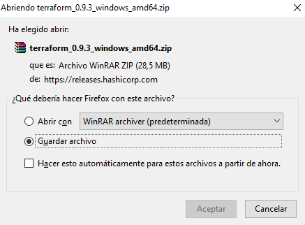

Creamos un directorio para el ejecutable de Terraform.

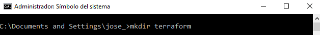

Copiamos el fichero descargado anteriormente al directorio terraform.

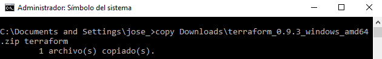

Nos situamos en el directorio terraform.

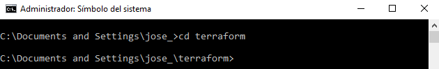

Descomprimimos el ejecutable en el interior del directorio creado anteriormente.

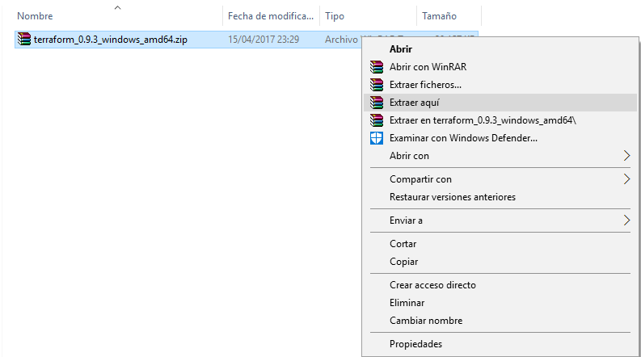
Ahora añadimos la variable de entorno de Terraform para el usuario, para ello en el menú inicio de Windows hacemos clic derecho en sistema.

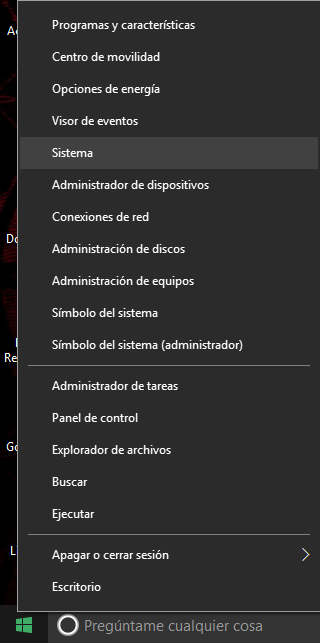

Hacemos clic en Configuración avanzada del sistema.

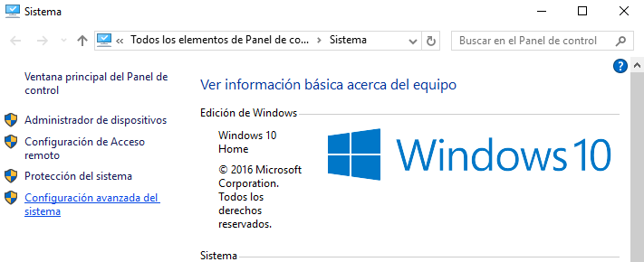

Hacemos clic en Variables de entorno.

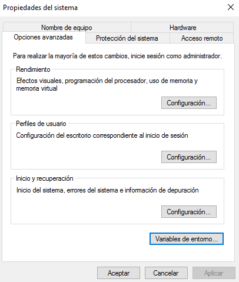

En la siguiente pantalla pulsamos el botón Nueva.

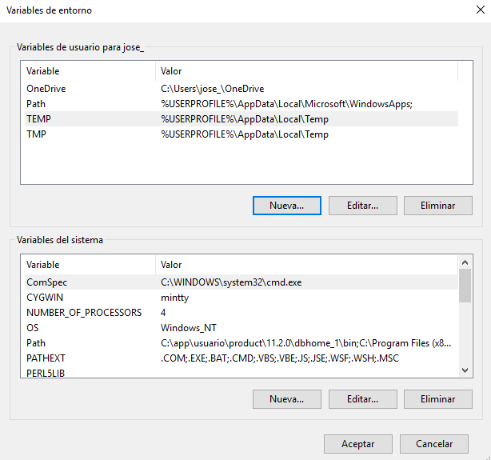

Asignamos un nombre a la variable y en el botón Examinar archivo buscamos la ruta del
ejecutable de Terraform.

Aceptamos y comprobamos que se ha guardado la variable de entorno.

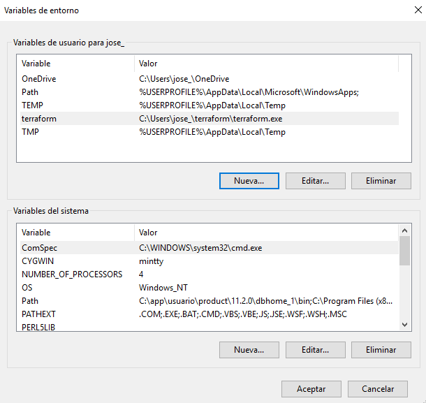

Ahora desde una ventana de símbolo de sistema comprobamos que Terraform funciona.

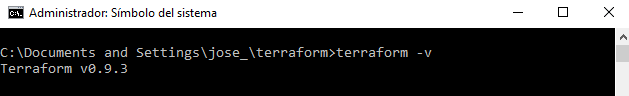
