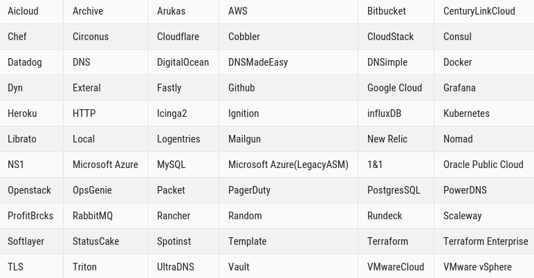

# Proveedores de Terraform

Los proveedores de Terraform se utilizan para crear, administrar y manipular recursos de la infraestructura. Los recursos de los proveedores son utilizados en máquinas físicas, máquinas virtuales, conmutadores de red, contenedores, etc. 

La lista completa de proveedores es la siguiente:

